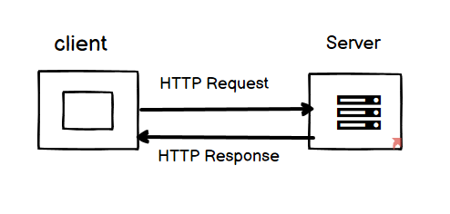

# Movies-Library

**Author Name**: Islam Al-Attar

## WRRC

## Overview
application that has libraries to view movies
## Getting Started

use postman and insert http://localhost:4444/getMovies or http://localhost:4444/addMovie

## Project Features
features that my project provides are:
1) you can add movies 
2) you can get movies